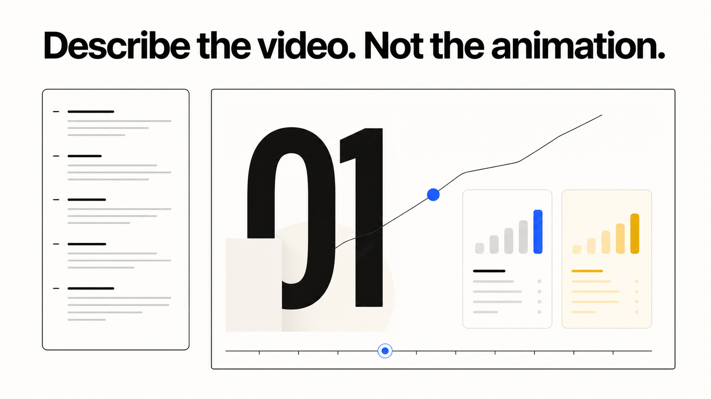

<p align="center">
  
</p>

# A2TL-Video

<p align="center">
  
</p>

**An agent should describe a video, not hand-author its animation.**

A2TL-Video turns a compact VDSL/1 description into an animated explainer, diagram, or product video. The language carries the story and visual intent; the runtime supplies layout, motion, transitions, and themes.

## Related work

A2TL-Video belongs to the same research family as [SkillNet](https://github.com/ANFAIA/SkillNet):
agents describe an artifact and a renderer owns the implementation details. SkillNet's current
learning interface uses [OpenUI](https://github.com/openai/openui); A2TL-Video is the audiovisual
counterpart, not a SkillNet runtime dependency.

The [19-second introduction](assets/a2tl-video-intro.mp4) in this repository was written in [VDSL](examples/a2tl-video-intro.vdsl) and made with A2TL-Video itself.

## A small video specification

```vdsl
VDSL/1
theme dark-tech
canvas 1920x1080

scene "The Problem" 6s crossfade
  text "Your data has no walls." hero center word-stagger 0-4s

scene "The Solution" 8s blur-crossfade
  viz 0.5-8s build-up
    type: flow-diagram
    steps:
      - label: "Label" desc: "tag your data" icon: 1 color: blue
      - label: "Check" desc: "verify at the gate" icon: 2 color: green
```

## Start here

```bash
git clone https://github.com/JoseEstevez520/a2tl-video.git
cd a2tl-video
npm install && npm run build
cd render && npm install && cd ..

# Open the smallest working specification in a self-contained player
npx vdsl play examples/hello-world.vdsl

# MP4 via the bundled Remotion renderer
npx vdsl render examples/a2tl-video-intro.vdsl -o intro.mp4
```

Begin with [examples/hello-world.vdsl](examples/hello-world.vdsl), then compare it with the richer [intro specification](examples/a2tl-video-intro.vdsl). Once it plays, render an MP4 with npx vdsl render examples/a2tl-video-intro.vdsl -o intro.mp4.

VDSL includes text, layouts, comparisons, cards, diagrams, data views, scene transitions, and four visual themes. Use npx vdsl themes to list them, or npx vdsl init my-video to start a file.

For browser playback, use the generated HTML directly or load `embed/vdsl-player.js` and point `<vdsl-player>` at it. A React player is also exported from `a2tl-video/react`.

## References

- [Language specification](docs/spec.md)
- [Runnable examples](examples/)
- [Agent skill](skill/SKILL.md)
- [Current status and known limitations](STATUS.md)
- [A2TL-Web](https://github.com/JoseEstevez520/a2tl-web), for interfaces rather than video
- [SkillNet](https://github.com/ANFAIA/SkillNet), the learning system where the wider GenUI research is applied
